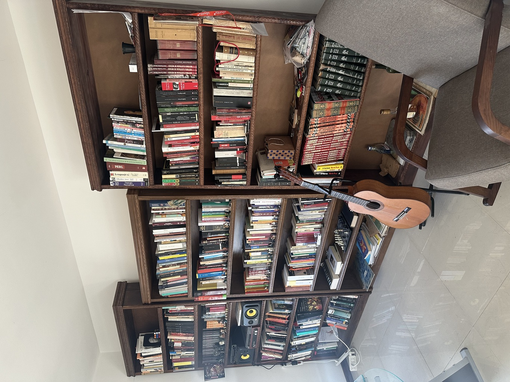
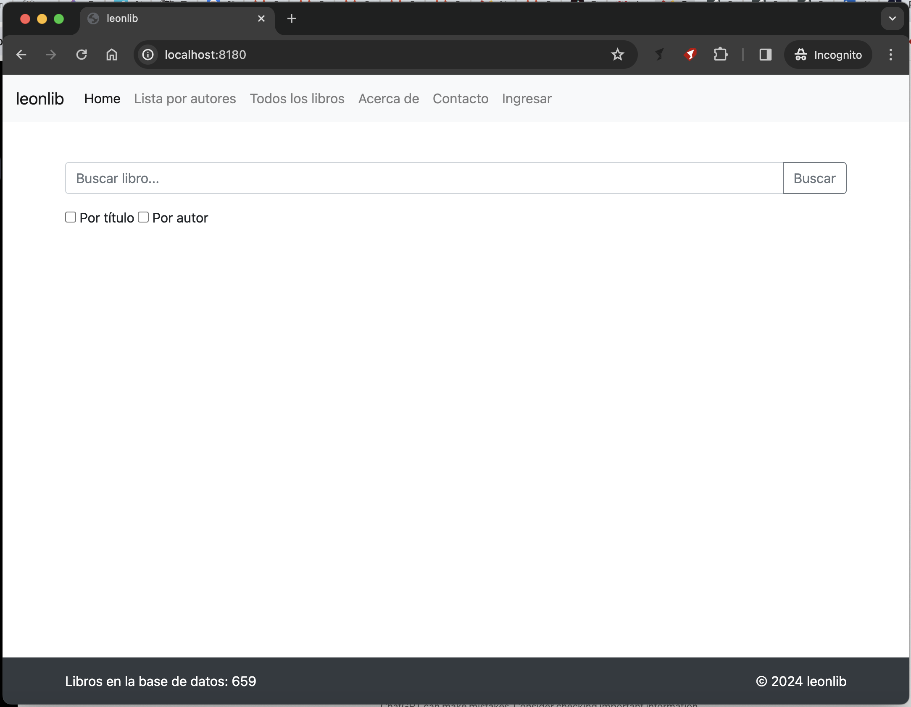
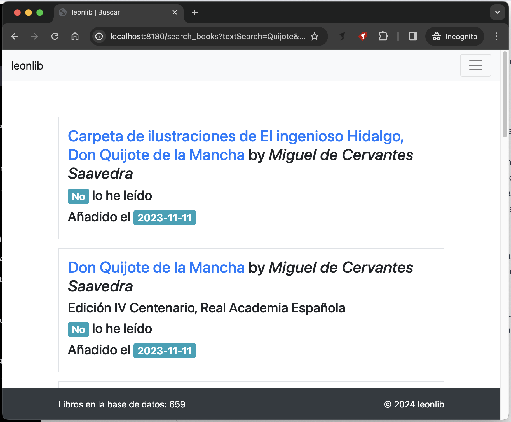
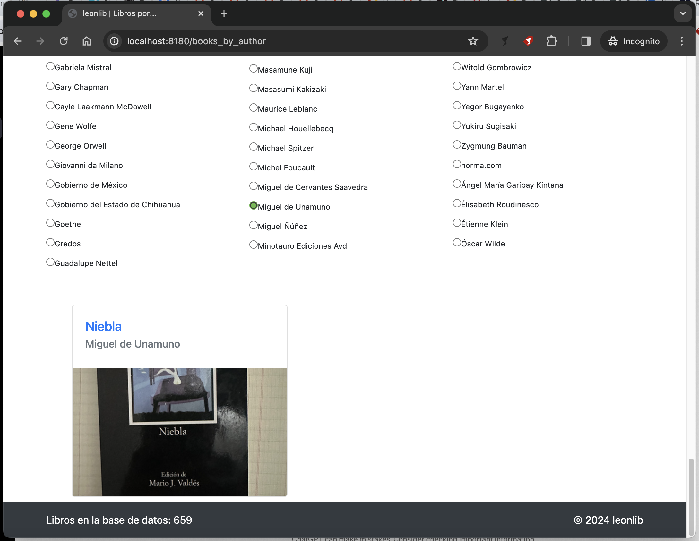
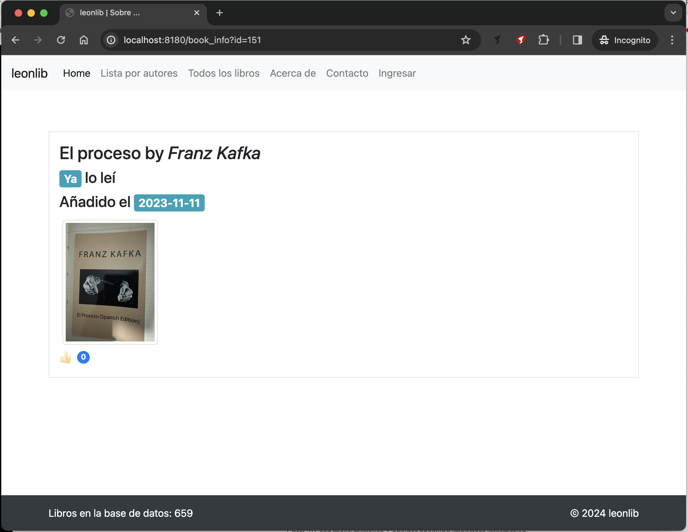
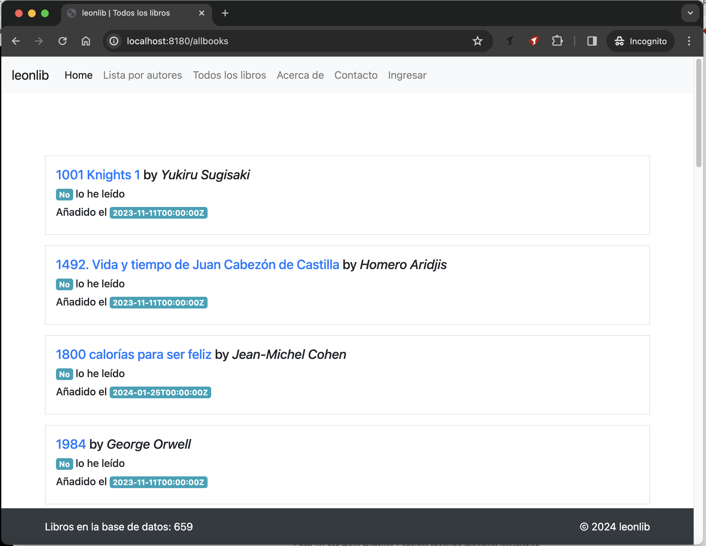
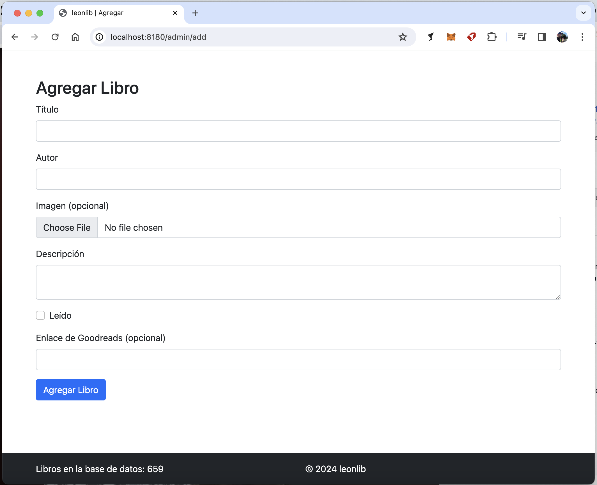
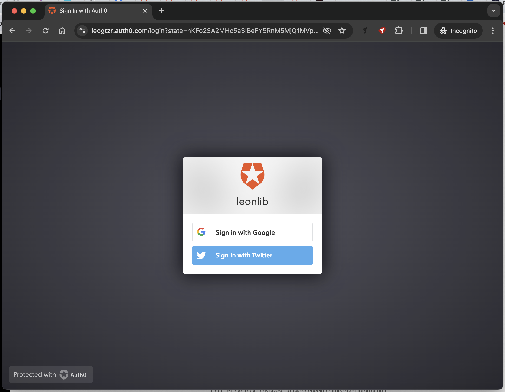

# leonlib
These are the books I own in my personal library

The objective of this simple application is to expose a way to explore the inventory of books I own.
I confess that I have bought the same book multiple times due to not knowing that I already have it.

## Technical Details

### Stack

- Go (gorilla/mux)
- Bootstrap
- Postgres
- SQLite
- Docker
- Shell (Bash)

## How to run it

To run the app using Postgres, run the script `run_app_with_postgres.sh`, it contains the command to use a specific
Dockerfile file.

To run the app using the SQLite application, use the `run_app_with_sqlite.sh` script. 

You can also run the application using an `in-memory` database, for that, use the `run_app_in_memory.sh` script.

## How it looks

### Home Page

### Searching a book

### Books per author

### Book Information

### All the books

### Add book

### Authentication

There is a simple Auth mechanism used to like any book in my library.

